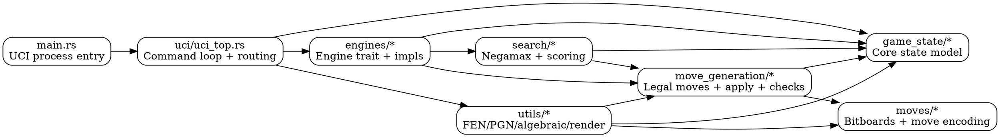
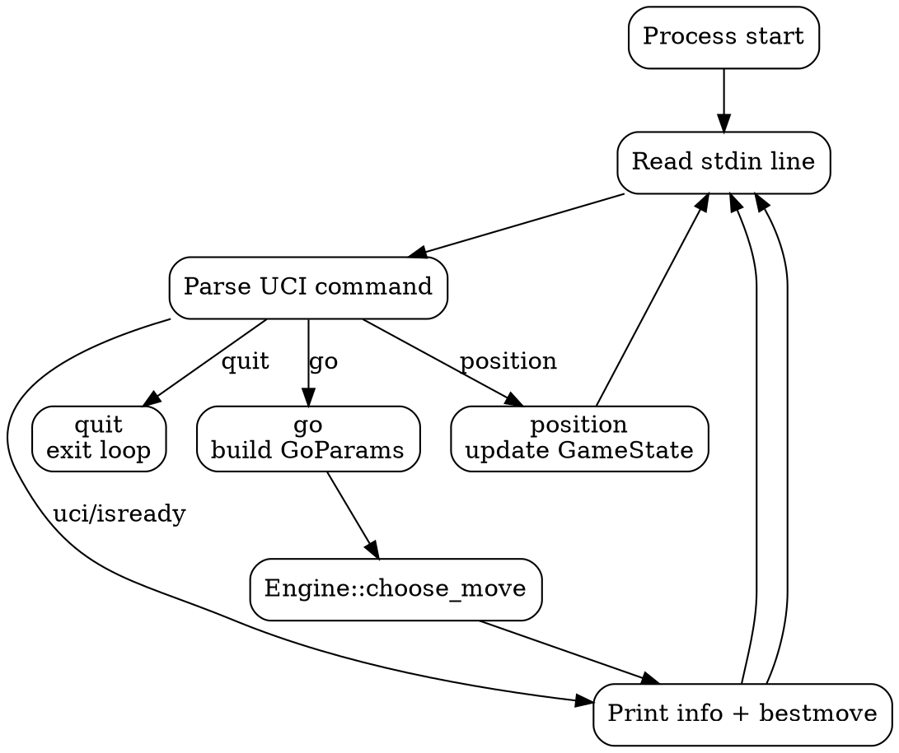
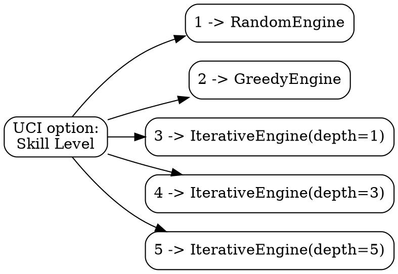

# Plum Chess Code Structure

This document explains how the project is organized, what each subsystem owns, and how data flows between components.

## High-level Organization

The codebase is organized by responsibility:

- `src/game_state/`: core chess state types and constants.
- `src/moves/`: low-level attack/bitboard primitives and packed move encoding.
- `src/move_generation/`: legal move generation, move application, attack/check checks, and perft.
- `src/search/`: board scoring interfaces and iterative deepening negamax alpha-beta.
- `src/engines/`: pluggable engine implementations (random/greedy/iterative).
- `src/uci/`: UCI protocol command loop and engine orchestration.
- `src/utils/`: notation/parsing/serialization/debug utilities (algebraic, FEN, PGN, rendering).
- `src/main.rs`: binary entry point (launches UCI loop).
- `src/lib.rs`: crate-level module exports.

## System Architecture Graph

## Core State Layer (`src/game_state`)

### Purpose
This layer defines the internal board representation and immutable type conventions used by the rest of the engine.

### Key files
- `chess_types.rs`
  - enums and aliases (`Color`, `PieceKind`, `Square`, `Move`, castling flags).
- `game_state.rs`
  - `GameState` incremental state (piece bitboards, occupancies, side-to-move, rights, clocks).
  - convenience constructors (`new_game`, `from_fen`, `get_fen`).
- `undo_state.rs`
  - undo payload schema for reversible operations.
- `chess_rules.rs`
  - canonical constants such as the standard starting FEN.

## Move Primitive Layer (`src/moves`)

### Purpose
This layer is the fast bitboard primitive layer. It does not decide legality; it computes attacks and move-field packing.

### Key files
- `*_moves.rs` (pawn, knight, bishop, rook, queen, king)
  - attack tables and/or occupancy-aware attack generation.
- `move_descriptions.rs`
  - packed move bit layout and helper accessors.

## Legal Move Generation Layer (`src/move_generation`)

### Purpose
Produces legal moves from a `GameState`, applies moves to produce future states, and validates correctness via perft.

### Key responsibilities
- piece-wise pseudo-legal generation (`legal_moves_*.rs`)
- special rules (castling, promotion, en-passant)
- legality filter (reject own-king-in-check)
- move application and state transitions (`legal_move_apply.rs`)
- attack/check detection (`legal_move_checks.rs`)
- shared query helpers (`legal_move_shared.rs`)
- trait/result contracts (`move_generator.rs`)
- perft recursion and metrics (`perft.rs`)

## Search Layer (`src/search`)

### Purpose
Contains configurable evaluation and tree search logic independent of UCI.

### Key files
- `board_scoring.rs`
  - `BoardScorer` trait for modular scoring.
  - `MaterialScorer` baseline implementation.
- `iterative_deepening.rs`
  - iterative deepening driver.
  - negamax alpha-beta core.
  - terminal score handling for mate/stalemate.

## Engine Layer (`src/engines`)

### Purpose
Wraps strategy-specific move selection behind a shared interface callable from UCI.

### Interface
- `engine_trait.rs`
  - `Engine` trait
  - `GoParams` (UCI-derived runtime hints)
  - `EngineOutput` (`best_move` + info lines)

### Implementations
- `engine_random.rs` (difficulty 1)
  - random legal move.
- `engine_greedy.rs` (difficulty 2)
  - highest immediate captured-material move.
- `engine_iterative.rs` (difficulties 3-5)
  - iterative deepening alpha-beta with material scoring.

## UCI Layer (`src/uci`)

### Purpose
Owns protocol compliance and engine lifecycle for GUI integration (PyChess, etc.).

### Current flow
- parse command line-by-line from stdin
- support `uci`, `isready`, `setoption`, `ucinewgame`, `position`, `go`, `stop`, `quit`
- convert `position` moves from long algebraic into internal move descriptions
- call active `Engine` and print `info`/`bestmove`

## UCI Runtime Flow Diagram

## Difficulty-to-Engine Mapping

## Utility Layer (`src/utils`)

### Purpose
Provides conversion and persistence helpers that are orthogonal to search strength.

### Key modules
- `algebraic.rs`: square <-> algebraic coordinate conversion.
- `long_algebraic.rs`: packed move <-> long algebraic conversion.
- `fen_parser.rs` / `fen_generator.rs`: FEN read/write.
- `pgn.rs`: PGN read/write with history replay.
- `render_game_state.rs`: Unicode board renderer for diagnostics.

## Testing and Validation Strategy

The project currently validates correctness primarily through:

- perft regression suites (nodes and tactical counters).
- notation/parser round-trip tests (FEN/PGN/algebraic/long algebraic).
- search unit tests for baseline behavior.
- UCI command-state behavior tests.

This gives high confidence that move legality and protocol integration remain stable while engine strength evolves.
