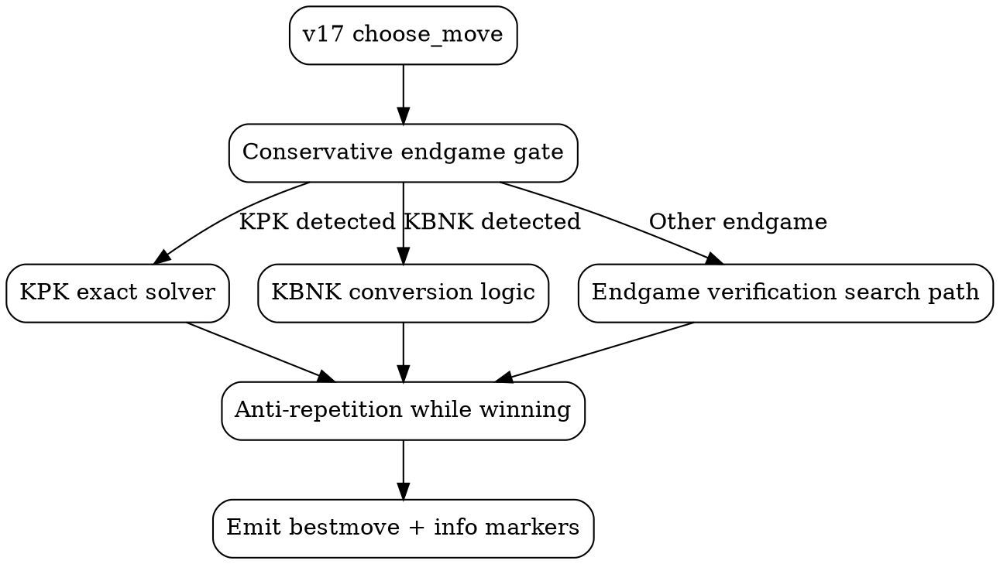
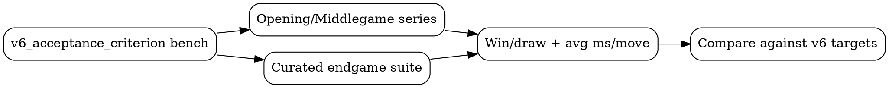

# Endgame Optimization Guide: Version 6 (v17)

This guide documents the endgame-focused optimization cycle for major version 6.
It follows the same style as the other project guides: what changed, why it
matters, and what results were observed.

Primary implementation files:

- `src/engines/engine_iterative_v17.rs`
- `src/engines/engine_humanized_v5.rs`
- `src/utils/engine_match_harness.rs`
- `benches/v6_acceptance_criterion.rs`
- `docs/requirements/v6.md`

## Objective

Version 6 targeted one core problem: converting winning endgames more reliably
without external tablebase files.

Design constraints:

- No external downloads or sidecar assets.
- Preserve UCI compatibility and existing option surface.
- Keep humanized engine compatibility.
- Accept up to `15%` speed regression for stronger endgame outcomes.

## Optimization Narrative

### 1) Create v17 as a safe rollout layer

`v17` began as a wrapper around `v16`. This allowed endgame-specific behavior
to be added incrementally while keeping `v16` available for A/B validation and
fallback.

Primary effect:

- `Stability`

### 2) Strengthen draw-avoidance while winning

A policy was added to avoid selecting immediate repetition lines in favorable
endgames. If the preferred move repeated and a non-repeating legal move existed
with better material/mate prospects, v17 redirected to the alternative.

Primary effect:

- `Strength`

### 3) Add conservative endgame mode gate

Endgame-specific logic was constrained behind a low-material trigger, so
aggressive or specialized endgame behavior does not leak into middlegames.

Primary effect:

- `Strength + Stability`

### 4) Add built-in KPK exact logic

King-and-pawn vs king handling was implemented in-engine with recursive outcome
evaluation and memoization, including cycle/depth safeguards.

Primary effect:

- `Strength`

### 5) Add KBNK conversion logic

KBNK-specific conversion heuristics were added to guide the defender king toward
the correct mating corner and improve technical conversion quality.

Primary effect:

- `Strength`

### 6) Endgame selectivity verification path

An endgame verification search path was added with:

- less aggressive tactical filtering,
- endgame-aware extension signals (checks, promotion pressure, pawn-race cues),
- quiescence filtering focused on forcing/tactical candidates.

Primary effect:

- `Strength`

### 7) Humanized engine backend migration to v17

`engine_humanized_v5` was switched from v16 backend to v17 backend while
preserving CPL-budgeted move selection behavior.

Primary effect:

- `Compatibility + Strength transfer`

### 8) Hash-consistency hardening

A subtle consistency issue was fixed in endgame helper evaluation paths that
temporarily modified side-to-move perspective. Hash fields are now refreshed on
flipped-side probe views to keep incremental and recomputed hashes coherent.

Primary effect:

- `Stability + Correctness`

### 9) Add reproducible v6 acceptance tooling

A dedicated runner was added to compare v16 vs v17 under repeatable settings:

- opening/middlegame series,
- curated endgame suite,
- timing proxy reporting.

Primary effect:

- `Process quality + Measurement rigor`

## Endgame Decision Flow

## Measurement Workflow

## Observed Outcomes (as of v6.9.0)

From acceptance runs during v6 closure:

- Opening/middlegame behavior was generally competitive and sometimes stronger.
- Endgame conversion goal was not yet consistently achieved against v16.
- Endgame speed in curated suites showed significant lag in current v17 logic.

In other words: the instrumentation and architecture are now in place, but
further endgame tuning remains available as a future iteration.

## Key Lessons

1. Endgame specialization must be explicitly bounded.
2. Verification paths can improve quality but are expensive if not tightly
   budgeted.
3. Reproducible acceptance tooling is essential; without it, regressions hide.
4. Hash/state consistency issues can look like search instability.

## Related Documents

- `docs/requirements/v6.md`
- `docs/optimization.md`
- `docs/humanizing.md`
- `docs/uci_enhancement.md`
