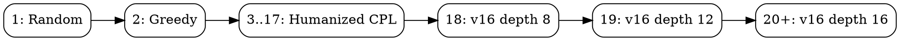
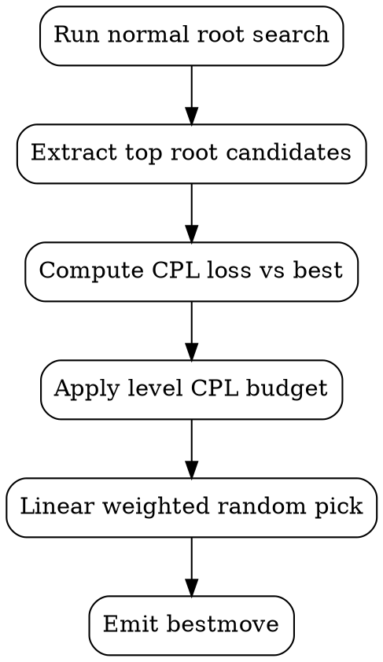

# Humanizing Guide: CPL-Based Difficulty Scaling (Version 5)

This guide explains the strategy used to make Plum Chess play in a more
human-like way across mid-range difficulty levels while preserving a strong
top-end mode.

Primary implementation files:

- `src/engines/engine_humanized_v5.rs`
- `src/uci/uci_top.rs`
- `docs/requirements/v5.md`

## Why Humanizing

A purely "best move every turn" engine often feels unnatural at lower levels:

- It can be tactically sharp but strategically robotic.
- Difficulty jumps can feel uneven.
- Players do not get a smooth training progression.

Version 5 introduces a controlled centipawn-loss (CPL) model to scale move
quality in a predictable way.

## Core Idea

Instead of always playing the highest-scoring move, the humanized engine:

1. Finds top root candidates from normal search.
2. Measures each candidate's CPL loss relative to the best move.
3. Applies a level-based CPL budget.
4. Randomly selects among allowed moves with linear weighting.

The result: lower levels make reasonable, human-like inaccuracies; higher levels
increasingly converge to best play.

## Difficulty Ladder

Mapping code lives in `build_engine` at `src/uci/uci_top.rs`.

## Strength Percent Model

For levels `3..=17`, strength percent is linear:

- level `3` -> `60%`
- level `17` -> `100%`

This value drives CPL budget shaping.

## CPL Budget Model

Let `p` be the strength percent in `[0, 1]`.

- Minimum CPL bound uses `sqrt(p)`:
  - `min_cpl = (1 - sqrt(p)) * K_min`
- Maximum CPL bound uses `p^2`:
  - `max_cpl = (1 - p^2) * K_max`
- Allowed CPL budget:
  - `allowed_cpl = max_cpl * (1 - p)` (then clamped to bounds)

This creates a non-linear quality curve:

- low levels: wider allowed CPL
- high levels: narrow allowed CPL

## Candidate Selection Pipeline

Implementation notes:

- Candidate extraction is parsed from root MultiPV-style info lines in
  `parse_multipv_candidates` (`src/engines/engine_humanized_v5.rs`).
- If fewer than 3 candidates exist, engine falls back to best move.
- If no non-best candidate fits budget, engine falls back to best move.

## Randomness Policy

Selection is linear-weighted among allowed candidates:

- smaller CPL loss -> higher weight
- larger CPL loss -> lower weight (but still possible at lower levels)

This avoids both extremes:

- not fully deterministic
- not uniformly random

## Opening Book and Time Management

Version 5 intentionally keeps existing behavior:

- Humanization applies **after** opening-book handling.
- Existing time-management strategy remains unchanged.

That keeps protocol and performance behavior stable while changing only move
choice style.

## Validation Strategy

Version 5 tests cover:

- Strength mapping and CPL formulas.
- Candidate parsing and selection behavior.
- Legal move output on static positions/FENs.
- UCI level mapping checks for level 3 (humanized) and level 18 (depth profile).

Relevant tests are in:

- `src/engines/engine_humanized_v5.rs`
- `src/uci/uci_top.rs`

## Practical Tuning Path

To tune behavior further:

1. Build a fixed-position suite (opening, middlegame, endgame).
2. Measure average CPL per level.
3. Adjust shaping constants (`K_min`, `K_max`) and rerun.
4. Validate level monotonicity (higher level should reduce CPL on average).

This gives a controlled framework for future "human style" upgrades in major
version 5+.
