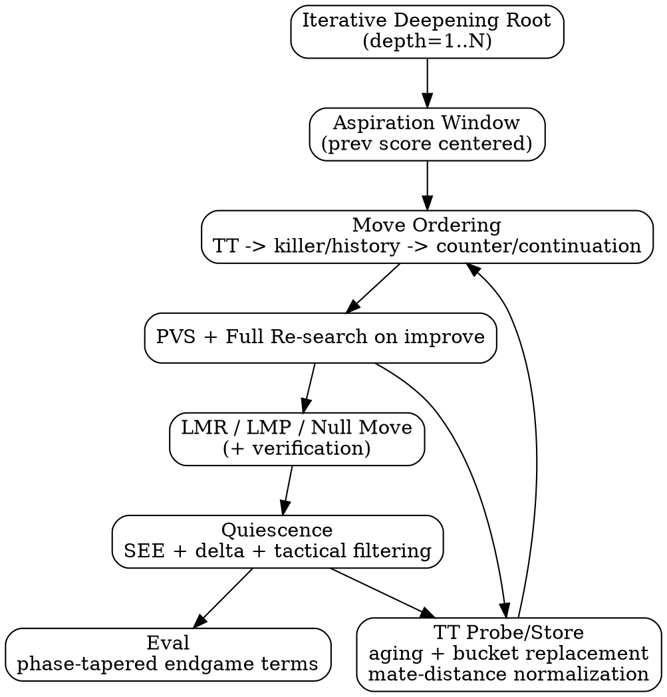
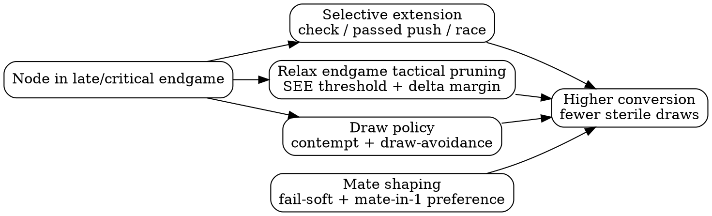

# Optimization Guide: Building the Iterative Engine

This guide summarizes the optimization path implemented in the iterative engine family and search backends. It is written for humans who want to understand not just *what* was changed, but *why* each change matters.

The source trail for this guide is the optimization markers in:

- `src/engines/engine_iterative_v*.rs`
- `src/search/iterative_deepening_v*.rs`
- `src/search/board_scoring.rs`
- `src/engines/time_management.rs`

## How To Read This Guide

- `Strength` means expected Elo / tactical / conversion gain.
- `Performance` means speed (nodes/sec), depth reach, or reduced overhead.
- Most changes affect both; classification indicates primary effect.

## Glossary: Technical Terms, Keywords, and Acronyms

- `Alpha-beta pruning`: Minimax optimization that skips branches that cannot affect the final decision under current `alpha`/`beta` bounds.
- `Aspiration window`: A narrow alpha-beta window centered around the previous iteration score; increases cutoffs when prediction is accurate.
- `Best move`: The move with highest evaluated score from the side-to-move perspective at the current search horizon.
- `Branching factor (b)`: Average number of legal moves per position.
- `Centipawn (cp)`: Score unit where 100 cp is roughly one pawn.
- `Check extension`: Extending search depth when a move gives check, to reduce tactical horizon misses.
- `Contempt`: Bias against drawish outcomes (typically near-equal positions), used to encourage decisive play.
- `Continuation history`: Move-ordering memory conditioned on prior move context (`previous move -> current move` pattern quality).
- `Countermove`: Heuristic table storing a strong reply to a previously seen move.
- `Cutoff`: Early branch termination when score proves the node is outside the relevant bound.
- `Depth`: Search distance measured in plies.
- `Draw-avoidance while winning`: Policy that penalizes repetition/draw lines when static eval indicates advantage.
- `Elo`: Relative playing-strength rating system for chess engines/players.
- `Evaluation (eval)`: Static score assigned to a position without full game-tree resolution.
- `Fail-high`: A search result meeting/exceeding `beta` (upper bound exceeded).
- `Fail-low`: A search result at/below `alpha` (lower bound not improved).
- `Fail-soft`: Returning the best known score beyond bounds (instead of clamping to `alpha`/`beta`), preserving more score information.
- `Horizon effect`: Tactical blindness caused by cutting search before a critical sequence resolves.
- `Killer heuristic`: Quiet moves that recently caused cutoffs at a given ply are prioritized in future sibling nodes.
- `Late Move Pruning (LMP)`: Skipping very late quiet moves in shallow nodes under specific conditions.
- `Late Move Reductions (LMR)`: Searching later, quieter moves at reduced depth first; re-search if they appear strong.
- `Move ordering`: Ranking candidate moves so likely best moves are searched earlier, maximizing alpha-beta efficiency.
- `NPS`: Nodes per second; a throughput metric for search speed.
- `Negamax`: Minimax variant exploiting score symmetry (`score = -opponent_score`) to simplify implementation.
- `Node`: One visited position in the search tree.
- `Null move pruning`: Try a “pass move” search to test whether position is so strong a cutoff is likely.
- `Null move verification`: Secondary search to confirm a null-move cutoff and reduce false positives.
- `Outside passed pawn`: A passed pawn far from the main pawn mass, often forcing king displacement.
- `Passed pawn`: Pawn with no opposing pawns on same/adjacent files ahead of it.
- `Phase / tapered eval`: Blending opening/middlegame/endgame evaluation components by material phase.
- `Ply`: One half-move (one side’s move).
- `Principal Variation (PV)`: Current best line found by search.
- `Principal Variation Search (PVS)`: Search first move with full window, then probe others with zero window and re-search only if needed.
- `Promotion preference`: Root-level policy favoring strong promotions (usually queen) over underpromotions when tactical context does not demand otherwise.
- `Quiescence search (qsearch)`: Extension at depth frontier that explores tactical moves to reduce horizon effect.
- `Replacement policy (TT)`: Rule for deciding which TT entry to overwrite on collisions (often depth/age/bound aware).
- `SEE (Static Exchange Evaluation)`: Fast material-exchange estimate on a square, used for tactical ordering/pruning.
- `Side to move`: The color whose turn it is; search scores are usually reported from this side’s perspective.
- `Stability`: Resistance to tactical/pathological regressions across time controls and position types.
- `Transposition`: Same position reached through different move orders.
- `Transposition Table (TT)`: Hash table caching previously searched positions (score, depth, bound, best move).
- `TT generation aging`: Tagging entries by search generation/age so stale results are less likely to displace current useful data.
- `Verification search`: Follow-up search performed after an aggressive pruning decision to confirm correctness.
- `Zugzwang`: Position where being forced to move is harmful; a key null-move pruning failure case.

## High-Level Journey

```dot
digraph optimization_journey {
  rankdir=LR;
  node [shape=box, style=rounded];

  base [label="Baseline\nIterative deepening + alpha-beta\n(material eval)"];
  endgame [label="Endgame awareness\nrepetition policy + king/passer terms"];
  ordering [label="Move ordering stack\nkiller/history/countermove/continuation"];
  pruning [label="Selective pruning\nLMR, LMP, null move, verification"];
  tt [label="TT evolution\naging -> bucketed replacement\nmate-distance normalization"];
  qsearch [label="QSearch refinement\nSEE + deeper checks + endgame tuning"];
  timing [label="Time management\n1/20 + adaptive budgeting"];
  conversion [label="Conversion policy\ncontempt, mate shaping,\nendgame extensions"];

  base -> endgame -> ordering -> pruning -> tt -> qsearch -> timing -> conversion;
}
```

## Optimization Map By Theme

### 1) Baseline iterative deepening + alpha-beta
Theory:
- Iterative deepening ensures you always have a move at any stop point.
- Alpha-beta dramatically reduces explored nodes with good ordering.
Classification:
- `Strength + Performance`
Where:
- `src/search/iterative_deepening.rs`
- `src/engines/engine_iterative_v1.rs`

### 2) Repetition-while-winning policy
Theory:
- Neutral draw scoring causes engines to accept repeats while better.
- Penalizing draw lines while ahead improves conversion behavior.
Classification:
- `Strength`
Where:
- `src/search/iterative_deepening_v3.rs`

### 3) Late-endgame check extension
Theory:
- In sparse positions, one checking tempo often decides outcomes.
- Extending those lines reduces horizon-induced tactical misses.
Classification:
- `Strength`
Where:
- `src/search/iterative_deepening_v3.rs`

### 4) Promotion-aware root selection
Theory:
- Most underpromotions are practical mistakes unless tactically forced.
- Queen preference improves conversion reliability.
Classification:
- `Strength`
Where:
- `src/engines/engine_iterative_v2.rs`

### 5) Killer heuristic
Theory:
- Quiet moves that previously caused cutoffs are strong ordering candidates.
Classification:
- `Performance + Strength`
Where:
- `src/search/iterative_deepening_v4.rs`

### 6) History heuristic
Theory:
- Move success statistics by side/piece/target square guide ordering quality.
Classification:
- `Performance + Strength`
Where:
- `src/search/iterative_deepening_v4.rs`

### 7) Late Move Reductions (LMR)
Theory:
- Late quiet moves are less likely to be best, so reduced-depth probes are efficient.
Classification:
- `Performance`
Where:
- `src/search/iterative_deepening_v4.rs`

### 8) Aspiration windows
Theory:
- Searching near the previous score with narrow bounds increases cutoff frequency.
Classification:
- `Performance`
Where:
- `src/search/iterative_deepening_v5.rs`

### 9) Null-move pruning
Theory:
- If a null move still holds beta, many real moves likely also hold; prune aggressively.
Classification:
- `Performance`
Where:
- `src/search/iterative_deepening_v5.rs`

### 10) Principal Variation Search (PVS)
Theory:
- Search the likely best move full-window; probe others zero-window first.
Classification:
- `Performance` (with indirect `Strength` from deeper reach)
Where:
- `src/search/iterative_deepening_v6.rs`

### 11) Countermove ordering
Theory:
- Strong tactical replies recur in similar local patterns.
Classification:
- `Performance + Strength`
Where:
- `src/search/iterative_deepening_v7.rs`

### 12) Continuation-history ordering
Theory:
- Move quality depends on move sequence context, not only individual move features.
Classification:
- `Performance + Strength`
Where:
- `src/search/iterative_deepening_v7.rs`

### 13) SEE tactical filtering (initial)
Theory:
- Static exchange estimation removes obviously losing tactical exchanges early.
Classification:
- `Performance`
Where:
- `src/search/iterative_deepening_v8.rs`

### 14) TT generation aging + replacement refinement
Theory:
- Prefer keeping current/deeper/reliable entries over stale ones.
Classification:
- `Performance + Stability`
Where:
- `src/search/iterative_deepening_v9.rs`

### 15) Late Move Pruning (LMP)
Theory:
- Past a depth- and move-index threshold, late quiet moves can be skipped.
Classification:
- `Performance`
Where:
- `src/search/iterative_deepening_v9.rs`

### 16) Null-move verification
Theory:
- Adds a guard re-search against false null cutoffs (especially zugzwang-like cases).
Classification:
- `Strength + Stability`
Where:
- `src/search/iterative_deepening_v10.rs`

### 17) 4-way bucketed TT
Theory:
- Multiple slots per index improve retention and reduce collision damage.
Classification:
- `Performance + Stability`
Where:
- `src/search/iterative_deepening_v11.rs`

### 18) Deeper quiescence + selective quiet checks
Theory:
- Tactical frontier search must follow forcing continuations further.
Classification:
- `Strength`
Where:
- `src/search/iterative_deepening_v12.rs`

### 19) Stronger SEE thresholds
Theory:
- Better SEE calibration balances tactical safety against over-pruning.
Classification:
- `Strength + Performance`
Where:
- `src/search/iterative_deepening_v12.rs`

### 20) Adaptive time management
Theory:
- Clock-aware budgeting improves practical strength under real game controls.
Classification:
- `Strength` (with practical time-efficiency benefits)
Where:
- `src/engines/time_management.rs`
- `src/engines/engine_iterative_v13.rs`

### 21) Expanded endgame tapered evaluation terms
Theory:
- Endgame conversion needs king activity, passer quality, rook placement, and opposition signals.
Classification:
- `Strength`
Where:
- `src/search/board_scoring.rs` (`EndgameTaperedScorerV14`)

### 22) Mate-distance consistency audit (TT score normalization)
Theory:
- Mate scores must encode/decode consistently across ply to avoid ordering/selection pathologies.
Classification:
- `Strength + Correctness`
Where:
- `src/search/iterative_deepening_v14.rs`
- `src/search/iterative_deepening_v15.rs`

### 23) Contempt + draw-avoidance tuning
Theory:
- Slight draw bias in near-equal nodes and stronger anti-draw pressure while winning improves decisiveness.
Classification:
- `Strength`
Where:
- `src/search/iterative_deepening_v15.rs`

### 24) Mate-score shaping (fail-soft cutoffs + root mate preference)
Theory:
- Preserve score granularity at cutoffs and explicitly prefer immediate mating continuations.
Classification:
- `Strength`
Where:
- `src/search/iterative_deepening_v15.rs`
- `src/engines/engine_iterative_v15.rs`

### 25) Selective endgame extensions
Theory:
- Extend only decisive endgame motifs (checks, advanced passer pushes, king-pawn race signals).
Classification:
- `Strength`
Where:
- `src/search/iterative_deepening_v15.rs`

### 26) Endgame-specific pruning tuning
Theory:
- Relax SEE/delta/LMP aggressiveness in critical endgames to avoid pruning decisive tempos.
Classification:
- `Strength + Stability`
Where:
- `src/search/iterative_deepening_v15.rs`

## Search Pipeline (Where Optimizations Plug In)

## Endgame Conversion Policy (Late Versions)

## Narrative Walkthrough (Theory + Classification)

The optimization journey started with the classic engine backbone: iterative deepening on top of negamax alpha-beta. That baseline matters because it gives two assets at once: tactical soundness that improves with depth, and a practical way to stop early with the best line found so far. From day one this was both a `Strength + Performance` foundation, because every later optimization depends on this search shape.

The first strategic pivot was philosophical rather than purely computational: the engine needed to stop accepting draws in winning positions. Repetition penalties while ahead and early endgame check extensions were introduced to make the search prefer conversion over safety. This stage was mostly a `Strength` upgrade, and it changed behavior in human-visible ways long before major speedups arrived.

Next came practical play hygiene. Promotion-aware root selection reduced underpromotion mistakes by preferring queen promotions unless a concrete tactic demanded otherwise. This seems small, but in live play it prevents many low-level conversion failures. This was a direct `Strength` gain.

After behavior was stabilized, the focus shifted to throughput: move ordering and selective pruning. Killer/history, then countermove and continuation history, taught the engine where cutoffs are likely. LMR, aspiration windows, null move pruning, and later LMP all worked toward a single goal: spend full-depth effort only where the branch still has realistic potential. These were primarily `Performance` improvements, but because better ordering reaches deeper principal lines, they also produced secondary `Strength` gains.

PVS (Principal Variation Search) was the next structural leap. Instead of searching every sibling move with a wide window, the engine searched the likely best move fully and challenged alternatives with narrow probes. This was mostly `Performance`, yet it often translates into better play because depth rises at fixed time.

As search got faster, transposition quality became the bottleneck. TT aging and replacement refinements improved cache usefulness, then 4-way bucketization improved collision handling under load. Later, mate-distance normalization fixed semantic consistency for mating scores across probe/store paths. Together these changes were `Performance + stability`, with mate-distance normalization adding an explicit `Strength + correctness` dimension.

Quiescence and SEE tuning formed another important chapter. Early SEE-guided filtering reduced tactical noise and prevented wasteful capture trees. Later, deeper quiescence with selective quiet checks and stronger SEE calibration improved horizon behavior. This sequence started as a speed control mechanism and matured into a mixed `Strength + Performance` block.

Time management came after core search maturity. A simple `1/20` budget rule provided predictable behavior, then adaptive budgeting used remaining time, increments, and game phase to allocate effort more intelligently. These were mostly `Strength` improvements under real game clocks, with practical performance side effects like fewer time-pressure collapses.

Evaluation then became endgame-centric. Moving from plain material to tapered endgame scoring and richer terms (rook file control, rook behind passer, opposition, outside passer, bishop pair in simplified positions) improved conversion in positions where tactical brute force alone is insufficient. This cluster was predominantly `Strength`.

In the latest phase, the engine became explicitly conversion-aware. Contempt and draw-avoidance policy reduced draw drift, mate-score shaping (fail-soft propagation plus immediate mate preference) improved mating consistency, and selective endgame extensions concentrated depth on king/pawn race moments. Finally, endgame-specific pruning tuning relaxed overly aggressive filters exactly where tempo sensitivity is highest. This end phase is best described as `Strength + stability`: fewer sterile draws, more clean conversions, and less brittleness in critical endings.

## Practical Takeaways For Readers

- The biggest speed multipliers came from ordering + pruning + TT quality.
- The biggest conversion gains came from draw policy, endgame eval, and endgame-specific selectivity.
- Mature engines require *coupled* tuning: a pruning gain can reduce strength unless evaluation and tactical safeguards are co-tuned.
- In this project, later progress was less about adding brand-new algorithms and more about making the existing stack context-aware (time, endgame phase, mate semantics, draw incentives).
