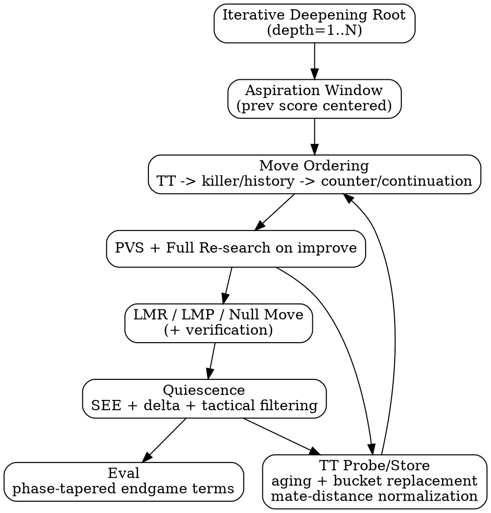
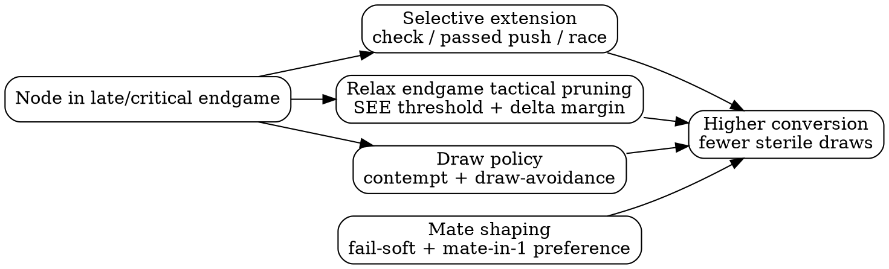

# Optimization Guide: Building the Iterative Engine

This guide summarizes the optimization path implemented in the iterative engine family and search backends. It is written for humans who want to understand not just *what* was changed, but *why* each change matters.

The source trail for this guide is the optimization markers in:

- `src/engines/engine_iterative_v*.rs`
- `src/search/iterative_deepening_v*.rs`
- `src/search/board_scoring.rs`
- `src/engines/time_management.rs`

## How To Read This Guide

- `Strength` means expected Elo / tactical / conversion gain.
- `Performance` means speed (nodes/sec), depth reach, or reduced overhead.
- Most changes affect both; classification indicates primary effect.

## Glossary: Technical Terms, Keywords, and Acronyms

- `Alpha-beta pruning`: Minimax optimization that skips branches that cannot affect the final decision under current `alpha`/`beta` bounds.
- `Aspiration window`: A narrow alpha-beta window centered around the previous iteration score; increases cutoffs when prediction is accurate.
- `Best move`: The move with highest evaluated score from the side-to-move perspective at the current search horizon.
- `Branching factor (b)`: Average number of legal moves per position.
- `Centipawn (cp)`: Score unit where 100 cp is roughly one pawn.
- `Check extension`: Extending search depth when a move gives check, to reduce tactical horizon misses.
- `Contempt`: Bias against drawish outcomes (typically near-equal positions), used to encourage decisive play.
- `Continuation history`: Move-ordering memory conditioned on prior move context (`previous move -> current move` pattern quality).
- `Countermove`: Heuristic table storing a strong reply to a previously seen move.
- `Cutoff`: Early branch termination when score proves the node is outside the relevant bound.
- `Depth`: Search distance measured in plies.
- `Draw-avoidance while winning`: Policy that penalizes repetition/draw lines when static eval indicates advantage.
- `Elo`: Relative playing-strength rating system for chess engines/players.
- `Evaluation (eval)`: Static score assigned to a position without full game-tree resolution.
- `Fail-high`: A search result meeting/exceeding `beta` (upper bound exceeded).
- `Fail-low`: A search result at/below `alpha` (lower bound not improved).
- `Fail-soft`: Returning the best known score beyond bounds (instead of clamping to `alpha`/`beta`), preserving more score information.
- `Horizon effect`: Tactical blindness caused by cutting search before a critical sequence resolves.
- `Killer heuristic`: Quiet moves that recently caused cutoffs at a given ply are prioritized in future sibling nodes.
- `Late Move Pruning (LMP)`: Skipping very late quiet moves in shallow nodes under specific conditions.
- `Late Move Reductions (LMR)`: Searching later, quieter moves at reduced depth first; re-search if they appear strong.
- `Move ordering`: Ranking candidate moves so likely best moves are searched earlier, maximizing alpha-beta efficiency.
- `NPS`: Nodes per second; a throughput metric for search speed.
- `Negamax`: Minimax variant exploiting score symmetry (`score = -opponent_score`) to simplify implementation.
- `Node`: One visited position in the search tree.
- `Null move pruning`: Try a “pass move” search to test whether position is so strong a cutoff is likely.
- `Null move verification`: Secondary search to confirm a null-move cutoff and reduce false positives.
- `Outside passed pawn`: A passed pawn far from the main pawn mass, often forcing king displacement.
- `Passed pawn`: Pawn with no opposing pawns on same/adjacent files ahead of it.
- `Phase / tapered eval`: Blending opening/middlegame/endgame evaluation components by material phase.
- `Ply`: One half-move (one side’s move).
- `Principal Variation (PV)`: Current best line found by search.
- `Principal Variation Search (PVS)`: Search first move with full window, then probe others with zero window and re-search only if needed.
- `Promotion preference`: Root-level policy favoring strong promotions (usually queen) over underpromotions when tactical context does not demand otherwise.
- `Quiescence search (qsearch)`: Extension at depth frontier that explores tactical moves to reduce horizon effect.
- `Replacement policy (TT)`: Rule for deciding which TT entry to overwrite on collisions (often depth/age/bound aware).
- `SEE (Static Exchange Evaluation)`: Fast material-exchange estimate on a square, used for tactical ordering/pruning.
- `Side to move`: The color whose turn it is; search scores are usually reported from this side’s perspective.
- `Stability`: Resistance to tactical/pathological regressions across time controls and position types.
- `Transposition`: Same position reached through different move orders.
- `Transposition Table (TT)`: Hash table caching previously searched positions (score, depth, bound, best move).
- `TT generation aging`: Tagging entries by search generation/age so stale results are less likely to displace current useful data.
- `Verification search`: Follow-up search performed after an aggressive pruning decision to confirm correctness.
- `Zugzwang`: Position where being forced to move is harmful; a key null-move pruning failure case.

## High-Level Journey

```dot
digraph optimization_journey {
  rankdir=LR;
  node [shape=box, style=rounded];

  base [label="Baseline\nIterative deepening + alpha-beta\n(material eval)"];
  endgame [label="Endgame awareness\nrepetition policy + king/passer terms"];
  ordering [label="Move ordering stack\nkiller/history/countermove/continuation"];
  pruning [label="Selective pruning\nLMR, LMP, null move, verification"];
  tt [label="TT evolution\naging -> bucketed replacement\nmate-distance normalization"];
  qsearch [label="QSearch refinement\nSEE + deeper checks + endgame tuning"];
  timing [label="Time management\n1/20 + adaptive budgeting"];
  conversion [label="Conversion policy\ncontempt, mate shaping,\nendgame extensions"];

  base -> endgame -> ordering -> pruning -> tt -> qsearch -> timing -> conversion;
}
```

## Optimization Map By Theme

### 1) Baseline iterative deepening and alpha-beta

Theory:
- Iterative deepening gives a usable best move at every depth and improves move ordering for deeper iterations.
- Alpha-beta transforms minimax from `O(b^d)` toward `O(b^(d/2))` under good ordering.

Classification:
- `Strength + Performance`

Where:
- `src/search/iterative_deepening.rs`
- early iterative engine wrappers (`src/engines/engine_iterative_v1.rs`)

---

### 2) Repetition-while-winning draw policy and early endgame check extension

Theory:
- Engines that score all draws as neutral can choose drawing lines while better.
- A draw-penalty while winning pushes search away from sterile repetition.
- Endgame check extension helps avoid horizon misses in low-material king races.

Classification:
- Repetition policy: `Strength`
- Endgame check extension: `Strength`

Where introduced:
- `src/search/iterative_deepening_v3.rs`

---

### 3) Promotion-aware root choice (queen preference)

Theory:
- Underpromotion is rarely best outside tactical motifs.
- Biasing root selection toward queen promotions reduces practical blunders and improves conversion.

Classification:
- `Strength`

Where:
- `src/engines/engine_iterative_v2.rs`

---

### 4) Move ordering memory: killer/history, then countermove+continuation

Theory:
- Alpha-beta is mostly a move-ordering problem.
- Killer and history heuristics prioritize moves that caused cutoffs in similar contexts.
- Countermove and continuation history encode local tactical/positional response patterns.

Classification:
- `Strength + Performance`

Where:
- Killer/history + LMR: `src/search/iterative_deepening_v4.rs`
- Countermove/continuation: `src/search/iterative_deepening_v7.rs`

---

### 5) Pruning ladder: LMR, aspiration windows, null move, LMP, verification

Theory:
- LMR: reduce depth for late quiet moves unlikely to be best, then re-search on fail-high.
- Aspiration windows: narrow alpha-beta window around previous iteration score to increase cutoffs.
- Null move: test whether doing nothing still holds beta, implying likely cutoff.
- Null verification: guards against false cutoffs (especially zugzwang-like cases).
- LMP: skip very late quiet moves in shallow nodes once enough evidence exists.

Classification:
- LMR / aspiration / null move / LMP: `Performance + some Strength`
- Null verification: `Strength + stability`

Where:
- LMR: `src/search/iterative_deepening_v4.rs`
- Aspiration + null move: `src/search/iterative_deepening_v5.rs`
- Null verification: `src/search/iterative_deepening_v10.rs`
- LMP: `src/search/iterative_deepening_v9.rs`

---

### 6) PVS (Principal Variation Search)

Theory:
- After first (best-ordered) move, most alternatives fail low.
- Searching non-PV moves with zero-width window is much cheaper; only re-search on improvement.

Classification:
- `Performance` (and indirect `Strength` from deeper reach)

Where:
- `src/search/iterative_deepening_v6.rs`

---

### 7) TT progression: aging, bucketization, replacement quality, mate-distance consistency

Theory:
- TT hit quality matters as much as hit rate.
- Aging prevents stale lines from displacing relevant current-search entries.
- Bucketed replacement improves retention under collisions.
- Mate-distance normalization prevents inconsistent mate score interpretation across plies.

Classification:
- Aging/bucketization: `Performance + stability`
- Mate-distance audit/normalization: `Strength + correctness`

Where:
- TT aging/replacement: `src/search/iterative_deepening_v9.rs`
- 4-way bucketed TT: `src/search/iterative_deepening_v11.rs`
- Mate-distance consistency: `src/search/iterative_deepening_v14.rs` and `src/search/iterative_deepening_v15.rs`

---

### 8) Quiescence and SEE tactical filtering

Theory:
- Plain depth cutoffs are noisy in tactical positions (horizon effect).
- Quiescence extends tactical lines (captures, promotions, checks in later versions).
- SEE-like gating removes hopeless tactical moves and prioritizes materially favorable exchanges.

Classification:
- Early SEE pruning: `Performance`
- Deeper qsearch + selective checks: `Strength`
- Net effect in mature form: `Strength + Performance`

Where:
- SEE tactical pruning/order: `src/search/iterative_deepening_v8.rs`
- Deeper qsearch + stronger SEE thresholds: `src/search/iterative_deepening_v12.rs`

---

### 9) Evaluation evolution: material -> AlphaZero values -> endgame tapered terms

Theory:
- Material-only eval is too coarse for conversion.
- Tapering (phase-aware weighting) increases endgame relevance of king activity and passed pawns.
- Additional endgame terms improve practical win conversion:
  - rook on open/semi-open file
  - rook behind passer
  - opposition
  - outside passer
  - bishop pair in simplified positions

Classification:
- Mostly `Strength` (small perf cost)

Where:
- `src/search/board_scoring.rs`
  - `AlphaZeroMetric`
  - `EndgameTaperedScorerV3`
  - `EndgameTaperedScorerV14`

---

### 10) Time management: fixed fraction and adaptive budgeting

Theory:
- Search strength depends on spending time where marginal depth matters most.
- Fixed fraction (`1/20`) is robust and simple.
- Adaptive budgeting uses remaining time, increment, phase, and optional movestogo.

Classification:
- Primarily `Strength` in real games; also practical `Performance` (less timeout risk)

Where:
- `src/engines/time_management.rs`
- adopted in engine wrappers (`src/engines/engine_iterative_v13.rs` onward)

---

### 11) Contempt and draw-avoidance when winning

Theory:
- Slight contempt in balanced positions avoids passive draw drift.
- Stronger draw penalties under clear advantage pushes the engine to convert instead of repeating.

Classification:
- `Strength`

Where:
- `src/search/iterative_deepening_v15.rs`

---

### 12) Mate-score shaping and conversion policy

Theory:
- Fail-soft propagation preserves score granularity (including mate distance trends) at cutoffs.
- Root-level immediate mate preference reduces missed short mates.
- Combined with TT mate normalization, this improves mating consistency.

Classification:
- `Strength`

Where:
- `src/search/iterative_deepening_v15.rs`
- `src/engines/engine_iterative_v15.rs`

---

### 13) Selective endgame extensions and endgame-specific pruning tuning

Theory:
- Endgames are tempo-sensitive; over-pruning quiet king/pawn maneuvers loses wins.
- Selective extensions focus depth where one extra ply is most valuable:
  - checking moves
  - advanced passed-pawn pushes
  - king-pawn race motifs
- Endgame-specific SEE/delta/LMP relaxation reduces tactical blindness in sparse positions.

Classification:
- Extensions: `Strength`
- Endgame pruning tuning: `Strength + stability` (small speed tradeoff)

Where:
- `src/search/iterative_deepening_v15.rs`

## Search Pipeline (Where Optimizations Plug In)

## Endgame Conversion Policy (Late Versions)

## Consolidated Step List (Theory + Classification)

1. Iterative deepening + alpha-beta baseline.
- Why: stable progressive search and fundamental pruning.
- Type: `Strength + Performance`.

2. Repetition penalty while winning.
- Why: avoid voluntary draw lines from advantageous positions.
- Type: `Strength`.

3. Late-endgame check extension.
- Why: improve tactical visibility where one tempo decides outcomes.
- Type: `Strength`.

4. Queen-promotion preference.
- Why: prevent practical underpromotion mistakes.
- Type: `Strength`.

5. Killer/history move ordering.
- Why: accelerate alpha-beta cutoffs with better ordering priors.
- Type: `Performance + Strength`.

6. LMR.
- Why: spend less depth on unlikely late quiet moves.
- Type: `Performance`.

7. Aspiration windows.
- Why: narrower windows increase cutoff density.
- Type: `Performance`.

8. Null move pruning.
- Why: cheaply detect fail-high regions.
- Type: `Performance`.

9. PVS.
- Why: zero-window search for non-PV moves lowers node count.
- Type: `Performance`.

10. Countermove + continuation history.
- Why: leverage local tactical context for ordering.
- Type: `Performance + Strength`.

11. SEE-guided quiescence filtering.
- Why: reduce tactical noise and useless exchanges.
- Type: `Performance`.

12. TT aging and replacement refinement.
- Why: retain relevant entries, reduce collision damage.
- Type: `Performance + stability`.

13. LMP.
- Why: skip low-value quiet tails in shallow nodes.
- Type: `Performance`.

14. Null verification search.
- Why: curb false null cutoffs in fragile positions.
- Type: `Strength + stability`.

15. Bucketed TT.
- Why: improve TT quality under high load.
- Type: `Performance + stability`.

16. Deeper quiescence with selective quiet checks.
- Why: improve tactical resolution at horizon.
- Type: `Strength`.

17. Stronger SEE thresholds.
- Why: better tactical filter calibration.
- Type: `Strength + Performance`.

18. Mate-distance TT consistency.
- Why: consistent mating score semantics across probe/store.
- Type: `Strength + correctness`.

19. Adaptive time management.
- Why: spend time where value is highest by phase/clock/inc.
- Type: `Strength`.

20. Expanded endgame tapered eval terms.
- Why: better conversion in simplified positions.
- Type: `Strength`.

21. Contempt + draw-avoidance.
- Why: reduce draw drift in winning/near-equal play.
- Type: `Strength`.

22. Mate-score shaping (fail-soft + root mate preference).
- Why: improve shortest-mate behavior and mating reliability.
- Type: `Strength`.

23. Selective endgame extensions.
- Why: allocate depth to decisive king/pawn motifs.
- Type: `Strength`.

24. Endgame-aware pruning tuning.
- Why: avoid over-pruning critical endgame tactics.
- Type: `Strength + stability`.

## Practical Takeaways For Readers

- The biggest speed multipliers came from ordering + pruning + TT quality.
- The biggest conversion gains came from draw policy, endgame eval, and endgame-specific selectivity.
- Mature engines require *coupled* tuning: a pruning gain can reduce strength unless evaluation and tactical safeguards are co-tuned.
- In this project, later progress was less about adding brand-new algorithms and more about making the existing stack context-aware (time, endgame phase, mate semantics, draw incentives).
