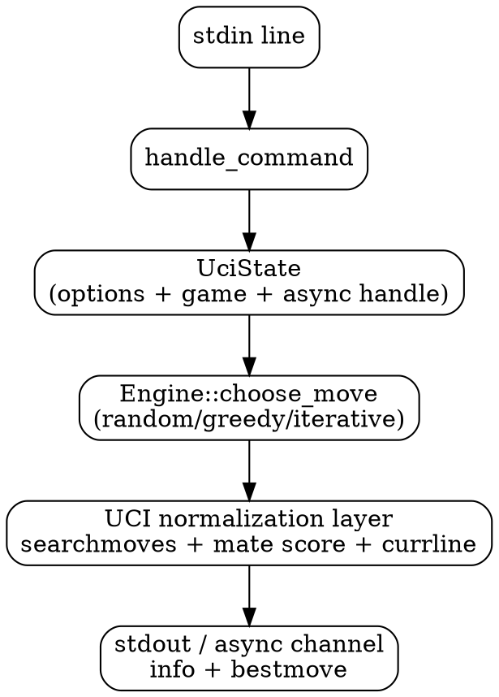

# UCI Enhancement Guide: Building a Practical Protocol Layer

This guide documents the UCI enhancement journey for Plum Chess. It focuses on how the interface evolved from a minimal command loop into a robust, GUI-friendly protocol surface.

Like the optimization guide, this is written for human readers who care about both behavior and engineering rationale.

The source trail for this guide is mainly:

- `src/uci/uci_top.rs`
- `src/engines/engine_iterative_v15.rs`
- `src/engines/engine_trait.rs`

## How To Read This Guide

- `Compatibility` means closer adherence to what GUIs expect from real UCI engines.
- `UX` means better live analysis feedback (richer `info` stream).
- `Correctness` means protocol behavior now reliably matches request semantics (e.g., `go mate`, `searchmoves`).

Most changes improve more than one axis; labels indicate primary intent.

## Glossary: UCI Terms, Keywords, and Acronyms

- `UCI`: Universal Chess Interface, a text protocol between chess GUI and engine.
- `GUI`: Front-end application (for example PyChess) that drives the engine process.
- `uci` / `uciok`: Startup handshake command and acknowledgement.
- `isready` / `readyok`: Liveness/synchronization ping and response.
- `setoption`: Command used by GUI to configure engine behavior.
- `option`: Capability line sent by engine during `uci` handshake.
- `go`: Search command with modes and limits.
- `bestmove`: Required terminal response for each completed `go`.
- `ponder`: Search mode where engine thinks during opponent time.
- `ponderhit`: Signal that predicted opponent move occurred.
- `searchmoves`: Restricts root search to a specified move subset.
- `MultiPV`: Number of top principal variations requested.
- `PV`: Principal Variation, the best line found by search.
- `currline`: Current line being explored/reported to GUI.
- `refutation`: Suggested tactical refutation line for an alternative move.
- `WDL`: Win/Draw/Loss estimate triplet.
- `cp`: Centipawn score unit (`100` roughly equals one pawn).
- `mate N`: Mating score in N moves convention.
- `TT`: Transposition table (search cache).

## High-Level Journey

```dot
digraph uci_journey {
  rankdir=LR;
  node [shape=box, style=rounded];

  base [label="Baseline UCI loop\n(uci/isready/position/go/stop/quit)"];
  options [label="Option surface expansion\nskill/hash/threads + UCI_* options"];
  go_semantics [label="go semantics hardening\nmate/searchmoves/async stop behavior"];
  analysis [label="Analysis stream upgrades\nwdl, multipv, currline, refutation"];
  compat [label="GUI compatibility polish\nregister stubs, rare options,\ntelemetry formatting"];

  base -> options -> go_semantics -> analysis -> compat;
}
```

## Enhancement Map By Theme

### 1) Core identity + startup reliability
Theory:
- GUIs kill engines that fail to complete handshake quickly and clearly.
- A stable startup sequence is the foundation for all later feature work.
Classification:
- `Compatibility`
Code examples:
- [`run_stdio_loop`](../src/uci/uci_top.rs)
- [`handle_command("uci")`](../src/uci/uci_top.rs)

### 2) Canonical engine metadata centralization
Theory:
- Central `name`/`author` constants prevent drift and keep output deterministic.
Classification:
- `Compatibility`
Code examples:
- [`UCI_ENGINE_NAME` / `UCI_ENGINE_AUTHOR`](../src/uci/uci_top.rs)

### 3) Option parsing and propagation framework
Theory:
- UCI support is mostly an options contract; parsing and forwarding must be reliable.
Classification:
- `Compatibility + Correctness`
Code examples:
- [`handle_setoption`](../src/uci/uci_top.rs)
- [`apply_engine_options`](../src/uci/uci_top.rs)

### 4) `Clear Hash` button semantics
Theory:
- GUIs expect a one-click reset of search memory without changing board state.
Classification:
- `Compatibility`
Code examples:
- [`option name Clear Hash`](../src/uci/uci_top.rs)
- `handle_setoption("Clear Hash")` in [`handle_setoption`](../src/uci/uci_top.rs)

### 5) UCI strength model (`UCI_LimitStrength` + `UCI_Elo`)
Theory:
- Many GUIs expose Elo sliders; engines should respond with predictable scaling.
- Mapping Elo to internal skill tiers makes this practical even without full Elo calibration.
Classification:
- `Compatibility + UX`
Code examples:
- [`elo_to_skill_level`](../src/uci/uci_top.rs)
- [`effective_skill_level`](../src/uci/uci_top.rs)

### 6) Additional UCI option coverage (`UCI_Opponent`, `UCI_EngineAbout`, `UCI_SetPositionValue`)
Theory:
- Some options are mostly informational but still expected by strict GUIs.
Classification:
- `Compatibility`
Code examples:
- UCI option lines in [`handle_command("uci")`](../src/uci/uci_top.rs)
- Storage/parsing in [`handle_setoption`](../src/uci/uci_top.rs)

### 7) `go mate` priority and semantics hardening
Theory:
- `go mate` intent must not be silently overridden by fixed-depth defaults.
- Explicit mate mode should produce stable, understandable behavior.
Classification:
- `Correctness`
Code examples:
- Mate-priority branch in [`handle_go`](../src/uci/uci_top.rs)
- Tests around mate handling in `#[cfg(test)]` within [`src/uci/uci_top.rs`](../src/uci/uci_top.rs)

### 8) Async search lifecycle hardening
Theory:
- UCI requires responsiveness while thinking; stop/restart transitions must remain deterministic.
- Async search should never deadlock stdio output.
Classification:
- `Compatibility + Correctness`
Code examples:
- [`start_async_search`](../src/uci/uci_top.rs)
- [`stop_async_search_and_collect`](../src/uci/uci_top.rs)

### 9) `searchmoves` strict enforcement (sync + async)
Theory:
- Even if a particular engine backend ignores restrictions, UCI layer must enforce contract.
- This prevents illegal or unexpected bestmove selection under constrained analysis.
Classification:
- `Correctness`
Code examples:
- [`enforce_searchmoves`](../src/uci/uci_top.rs)
- Integration points in `go`, `stop`, and `ponderhit` paths in [`src/uci/uci_top.rs`](../src/uci/uci_top.rs)

### 10) `MultiPV` option and first implementation
Theory:
- Analysis GUIs rely on ranked alternatives, not only one best line.
- Even heuristic MultiPV is better than missing feature support.
Classification:
- `UX + Compatibility`
Code examples:
- UCI option + parsing in [`src/uci/uci_top.rs`](../src/uci/uci_top.rs)
- Engine handling in [`set_option("MultiPV")`](../src/engines/engine_iterative_v15.rs)
- Multipv line generation in [`build_multipv_lines`](../src/engines/engine_iterative_v15.rs)

### 11) MultiPV quality upgrade to deeper candidate lines
Theory:
- True MultiPV quality requires more than static ranking; each candidate needs line continuation context.
- Reduced-depth child refinement gives stronger relative ordering without full duplicate root searches.
Classification:
- `UX + Strength-adjacent`
Code examples:
- Candidate model and ranking in [`rank_root_candidates`](../src/engines/engine_iterative_v15.rs)
- Per-candidate continuation export in [`build_multipv_lines`](../src/engines/engine_iterative_v15.rs)

### 12) `UCI_ShowRefutations` payloads
Theory:
- Exposing refutations makes analysis panes materially more useful.
- Option support without payloads creates GUI/engine expectation mismatch.
Classification:
- `UX + Compatibility`
Code examples:
- `UCI_ShowRefutations` parsing in [`handle_setoption`](../src/uci/uci_top.rs)
- Refutation emission in [`build_refutation_lines`](../src/engines/engine_iterative_v15.rs)

### 13) `UCI_ShowCurrLine` payloads
Theory:
- Current-line feedback improves user trust during deeper searches.
- Providing fallback from PV to best move keeps output robust when PV is sparse.
Classification:
- `UX`
Code examples:
- Currline extraction helpers in [`src/uci/uci_top.rs`](../src/uci/uci_top.rs)
- Final emission in [`emit_engine_output`](../src/uci/uci_top.rs)

### 14) Mate-score normalization for GUI readability
Theory:
- Some backends report near-mate as large `cp` values; GUIs display better with explicit `mate N`.
- Normalizing at UCI layer creates consistent output without forcing every engine backend to change.
Classification:
- `Compatibility + UX`
Code examples:
- [`cp_to_mate_moves`](../src/uci/uci_top.rs)
- Mate line insertion in [`emit_engine_output`](../src/uci/uci_top.rs)

### 15) Async telemetry standardization (`seldepth`, `nodes`, `time`, `nps`)
Theory:
- GUIs commonly expect standardized periodic telemetry fields to drive analysis widgets.
- Including these fields improves perceived responsiveness and debuggability.
Classification:
- `UX + Compatibility`
Code examples:
- Snapshot extraction in [`extract_last_search_stats`](../src/uci/uci_top.rs)
- Async emission path in [`start_async_search`](../src/uci/uci_top.rs)

### 16) Registration compatibility stubs
Theory:
- Most modern engines do not require registration, but explicit graceful responses improve interoperability.
Classification:
- `Compatibility`
Code examples:
- [`handle_register`](../src/uci/uci_top.rs)

## UCI Runtime Flow (Current)

## Info Stream Evolution

```dot
digraph info_evolution {
  rankdir=LR;
  node [shape=box, style=rounded];

  minimal [label="Minimal info\n(bestmove only)"];
  wdl [label="WDL estimates"];
  multipv [label="MultiPV ranked lines"];
  refute [label="Refutation lines"];
  currline [label="Current line reporting"];
  telemetry [label="Async telemetry\nseldepth/nodes/time/nps"];

  minimal -> wdl -> multipv -> refute -> currline -> telemetry;
}
```

## Narrative Walkthrough

The UCI layer began as a functional command loop: enough to receive positions and return moves, but not enough to behave like a mature engine in demanding GUIs. The first phase focused on handshake stability, predictable output, and option plumbing. This provided a stable substrate where features could be added without introducing fragile behavior.

From there, the project moved into option-surface expansion. Core settings such as hash, threads, skill level, and book control were already useful, but practical GUI integration demanded deeper UCI-specific options. `UCI_LimitStrength` and `UCI_Elo` introduced user-facing strength control that could map onto internal difficulty tiers, while metadata options (`UCI_Opponent`, `UCI_EngineAbout`) improved protocol completeness.

The next phase hardened `go` semantics. `go mate` handling was tightened so mate intent stayed authoritative even with fixed-depth defaults. This was a correctness milestone: instead of ambiguous behavior under mixed controls, the interface now conveyed precise intent to the search layer.

As asynchronous search matured, stop/ponder transitions were made more deterministic, and critical constraints such as `searchmoves` were enforced at the UCI boundary. This is an important architectural decision: protocol guarantees should not depend on every engine backend remembering every constraint.

With correctness largely in place, attention shifted to analysis UX. MultiPV support arrived first, then evolved from simple ranked roots to deeper line continuations per candidate. Refutation and current-line output completed the interactive analysis story, allowing GUIs to present richer context rather than only the final move.

Final polish focused on output quality and compatibility details: near-mate cp normalization into `mate N`, async telemetry snapshots (`seldepth/nodes/time/nps`), and explicit registration stubs. None of these by themselves changes chess strength directly, but together they substantially improve how usable, debuggable, and GUI-friendly the engine feels in real workflows.

## Practical Takeaways

- UCI robustness comes from a clear split of responsibilities:
  - Engine computes chess.
  - UCI layer enforces protocol guarantees and presentation consistency.
- Option support is not just parsing; it also means propagation across sync and async paths.
- Analysis features (`multipv`, `currline`, `refutation`, telemetry) are as important to user trust as raw strength.
- Small compatibility stubs (`register`, rare options) remove surprising GUI edge-case failures.
